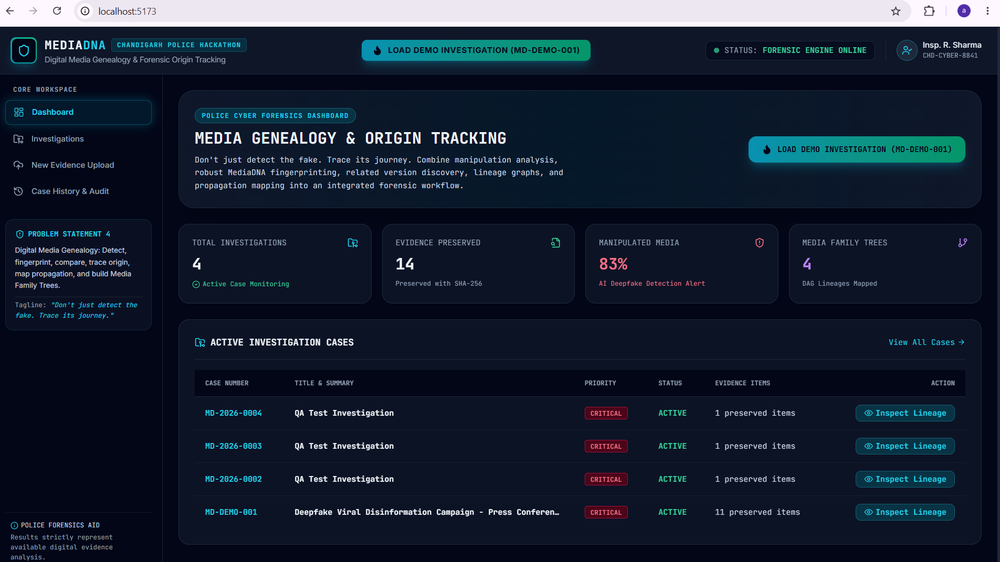

# MEDIA DNA: Digital Media Genealogy & Forensic Origin Tracking

> **Official Submission for Chandigarh Police Hackathon -- Problem
> Statement 4**\
> *Tagline*: **"Don't just detect the fake. Trace its journey."**

------------------------------------------------------------------------

## 1. Executive Overview

**MEDIA DNA** is a digital media forensic investigation platform built
specifically for police cybercrime units and forensic investigators.
Existing commercial and open-source tools focus almost exclusively on
binary deepfake detection ("Real" vs "Fake"), which fails to answer the
critical questions required for criminal investigations:

-   *Where did this manipulated media originate within available
    evidence?*
-   *What specific transformations occurred at each stage of
    dissemination?*
-   *Which version is the earliest traceable occurrence?*
-   *How did it propagate across public channels and platforms?*

MediaDNA solves this problem through **Digital Media Genealogy**:
combining modular manipulation detection, multi-signal perceptual
fingerprinting, pairwise version comparison, automated relationship
classification, DAG lineage construction, propagation mapping, and
cryptographic SHA-256 evidence integrity.

------------------------------------------------------------------------

## 2. Technical Architecture

``` text
                               ┌────────────────────────────────────────┐
                               │       React Vite Cyber Dashboard       │
                               │   (Dark Forensic UI / SVG DAG Tree)    │
                               └───────────────────┬────────────────────┘
                                                   │ REST API (JSON)
                               ┌───────────────────▼────────────────────┐
                               │           FastAPI Gateway              │
                               └───────────────────┬────────────────────┘
                                                   │
     ┌───────────────────┬─────────────────────────┼─────────────────────────┬───────────────────┐
     │                   │                         │                         │                   │
┌────▼──────────────┐ ┌──▼───────────────┐ ┌────────▼──────────────┐ ┌───────▼──────────────┐ ┌──▼───────────────┐
│  Evidence Store   │ │ AI & Forensic    │ │  MediaDNA Engine     │ │ Relationship        │ │ Genealogy Engine  │
│ Preserved SHA-256 │ │ Analysis         │ │ (6-Layer Multi-Signal│ │ Engine (Classifier/ │ │ (Family Tree DAG, │
│ Derived Copies    │ │ (Deepfake, EXIF) │ │  Perceptual Vectors) │ │  Rules & Evidence)  │ │  Earliest Trace)  │
└───────────────────┘ └──────────────────┘ └──────────────────────┘ └─────────────────────┘ └───────────────────┘
```

------------------------------------------------------------------------

## 3. Core Technical Innovations

### A. 6-Layer Multi-Signal MediaDNA Fingerprint

Unlike simple cryptographic hashes (SHA-256) which break completely upon
1-pixel edits or re-compression, **MediaDNA** constructs a resilient
6-layer fingerprint:

1.  **Visual DNA**: Multi-hash perceptual signatures (dhash, phash,
    colorhash) + 64-dimensional normalized visual feature vectors.
2.  **Face DNA**: Face detection bounding boxes, landmark alignment, and
    facial identity embeddings.
3.  **Audio DNA**: Spectral peak fingerprinting, duration matching, and
    audio stream detection.
4.  **Structural DNA**: Aspect ratio, resolution, container metadata,
    bitrate, and codec details.
5.  **Text DNA**: OCR extracted overlay text, captions, and detected
    watermarks.
6.  **Forensic DNA**: Error Level Analysis (ELA) energy variance, noise
    distribution profile, and EXIF headers.

### B. Media Version Lineage & Relationship Engine

Automatically classifies relationship classes between pairwise media
items:

-   `SAME_MEDIA`
-   `CROPPED_VERSION`
-   `RESIZED_VERSION`
-   `REENCODED_VERSION`
-   `TEXT_ADDED`
-   `WATERMARK_ADDED`
-   `AUDIO_REPLACED`
-   `FACE_MODIFIED` (Deepfake/Face swap)
-   `PARTIAL_DERIVATIVE`
-   `UNRELATED`

Every classification provides **explainable supporting evidence** and
**detected transformations** (e.g., *"Aspect ratio shift from 1.78 to
1.33 (Crop)", "New text overlay detected: 'BREAKING CURFEW'"*).

### C. Media Family Tree (DAG Lineage Visualizer)

Constructs a Directed Acyclic Graph (DAG) connecting parent and child
versions:

-   Pinpoints the **Earliest Traceable Occurrence** with a highlighted
    root badge.
-   Interactive edge inspection explaining *"WHY ARE THEY RELATED?"*.
-   Node drawers displaying SHA-256 hashes and reverse lineage paths
    back to the origin.

------------------------------------------------------------------------

## 4. 1-Click Hackathon Demo Scenario (`MD-DEMO-001`)

The platform includes a pre-packaged 5-generation synthetic media
lineage case (`MD-DEMO-001`):

-   **Node A (Original)**: Official Govt Press Release Photo (Earliest
    Traceable)
-   **Node B (Cropped)**: 4:3 Crop shared on Twitter
-   **Node C (Text Overlay)**: Fake Curfew Announcement Subtitle added
    on Telegram
-   **Node D (Deepfake)**: Face Swap filter applied over speaker
-   **Node E (Viral Copy)**: Downscaled high-compression copy
    circulating virally on WhatsApp

------------------------------------------------------------------------

## 5. Demo & Evidence

### Demo Videos

A complete walkthrough of MEDIA DNA is available in the public demo
folder:

**[Open MEDIA DNA Demo
Videos](https://drive.google.com/drive/folders/1wZ4dCVMauWVtDmPSdI1XIH6h9l5ycy0-?usp=sharing)**

The folder contains the two demonstration videos used for the hackathon
submission.

### Interface Screenshots

#### Dashboard



The dashboard provides the investigation entry point, evidence status,
active investigations, and access to the `MD-DEMO-001` forensic case.

#### Media Family Tree / DAG Lineage


The lineage view connects related media versions and exposes
transformations between parent and derived evidence.

#### Authenticity & AI Analysis


The analysis view presents manipulation probability, model confidence,
forensic indicators, and explainable evidence signals.

------------------------------------------------------------------------

## 6. Technology Stack

-   **Frontend**: React, Vite, JavaScript, Tailwind CSS, Lucide Icons,
    Recharts
-   **Backend**: Python 3.14+, FastAPI, SQLAlchemy, Pydantic, Uvicorn
-   **AI/Forensics & Image Processing**: OpenCV, Pillow, PyWavelets,
    ImageHash, NumPy, SciPy, NetworkX
-   **Security & Database**: SQLite (PostgreSQL compatible), SHA-256
    evidence hashing, JWT auth

------------------------------------------------------------------------

## 7. How to Run the Platform

### Step 1: Start Backend API Server

From the project root:

``` bash
cd backend
pip install -r requirements.txt
uvicorn app.main:app --reload --port 8000
```

Backend API:

`http://127.0.0.1:8000`

OpenAPI documentation:

`http://127.0.0.1:8000/docs`

### Step 2: Start the Built Frontend

The current repository contains the production-built frontend in
`frontend/dist` and a lightweight Python proxy that connects it to the
FastAPI backend.

Open a second terminal:

``` bash
cd frontend
python proxy_server.py
```

Frontend:

`http://localhost:5173`

The proxy serves the built frontend and forwards `/api/*` requests to
the FastAPI backend on port `8000`.

### Step 3: Run the Hackathon Demo

1.  Open `http://localhost:5173`.
2.  Click **LOAD DEMO INVESTIGATION (MD-DEMO-001)**.
3.  Explore:
    -   **Media Family Tree**
    -   **Overview**
    -   **Authenticity & AI Analysis**
    -   **MediaDNA Fingerprint**
    -   **Related Lineage**
    -   **Modification Timeline**
    -   **Propagation**

------------------------------------------------------------------------

## 8. Project Structure

``` text
MediaDNA/
├── backend/
│   ├── app/
│   └── requirements.txt
├── frontend/
│   ├── dist/
│   ├── index.html
│   └── proxy_server.py
├── screenshots/
│   ├── dashboard.png
│   ├── media-family-tree.png
│   └── authenticity-analysis.png
├── .env.example
├── .gitignore
└── README.md
```

------------------------------------------------------------------------

## 9. Investigation Workflow

``` text
Evidence
   ↓
Fingerprint
   ↓
Compare
   ↓
Classify Relationship
   ↓
Construct Media Family Tree
   ↓
Trace Earliest Available Occurrence
   ↓
Analyze Propagation
   ↓
Preserve Evidence Integrity
```

### Media Genealogy

Trace relationships between different versions of the same media and
construct a visual lineage.

### Transformation Detection

Identify transformations such as cropping, resizing, re-encoding, text
overlays, watermarking, audio replacement, and face modification.

### AI-Assisted Authenticity Analysis

Present manipulation indicators, probability estimates, model
confidence, and explainable forensic signals to support investigator
review.

### Evidence Integrity

Use SHA-256 hashing to preserve and verify evidence identity.

### Earliest Traceable Occurrence

Identify the earliest version found within the available investigation
evidence and connect later derivatives to it.

### Propagation Mapping

Represent how media versions move across accessible channels and
investigation evidence.

------------------------------------------------------------------------

## 10. GitHub Repository

**[MEDIA DNA -- GitHub
Repository](https://github.com/akshayajd12/MediaDNA)**

The repository contains the backend, built frontend, configuration
files, screenshots, and documentation required to reproduce and evaluate
the project.

------------------------------------------------------------------------

## 11. Mandatory Forensic Disclaimers

The UI and report generator strictly enforce neutral forensic language:

1.  *"AI analysis is an investigative aid and does not constitute
    definitive forensic proof."*
2.  *"Origin tracing identifies the earliest traceable occurrence within
    the available evidence, not necessarily the true original source."*
3.  *"Propagation mapping is limited to accessible public or
    investigator-provided evidence."*

------------------------------------------------------------------------

## 12. Hackathon Value Proposition

**MEDIA DNA** moves beyond a simple **Real vs Fake** decision.

It provides an investigation-oriented workflow for:

**Detect → Fingerprint → Compare → Relate → Trace → Visualize → Preserve
Evidence**

The central objective is to help investigators understand **where a
media item can be traced within the available evidence, how it changed,
and how its versions propagated**.
